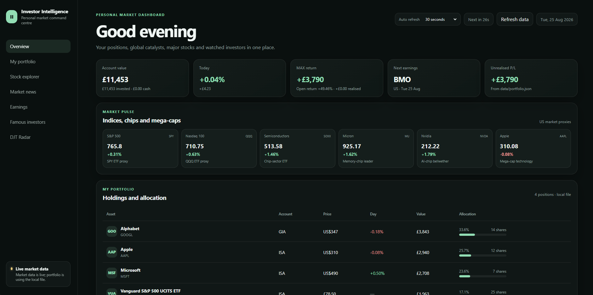
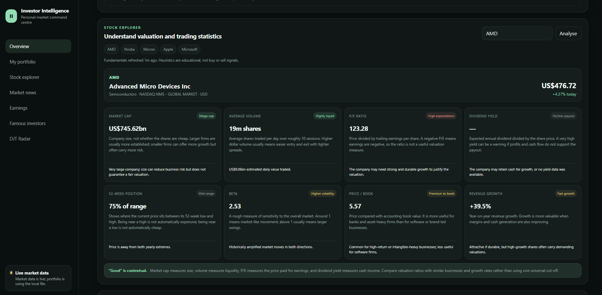
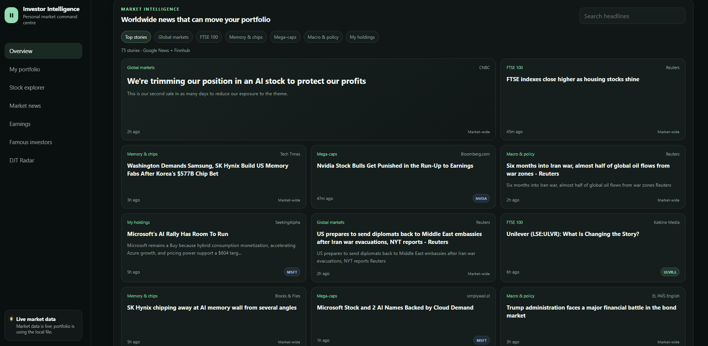
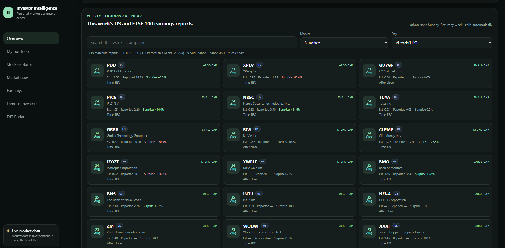
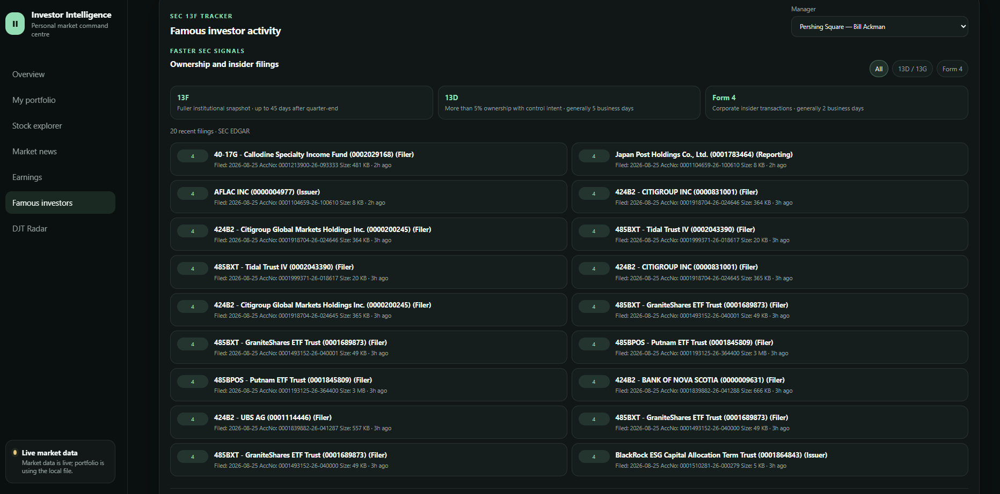
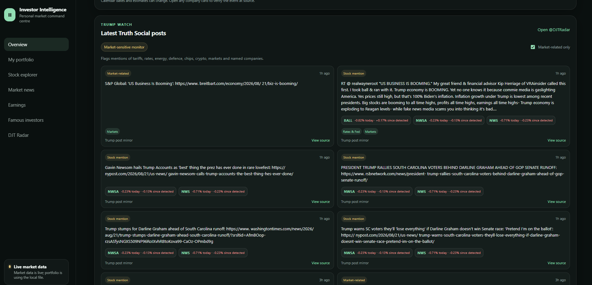

# Investor Intelligence Dashboard

A Netlify-powered market intelligence dashboard that combines portfolio analytics, stock fundamentals, market news, weekly earnings, SEC filings and event-driven company monitoring in one interface.

Built with vanilla JavaScript, serverless Netlify Functions and live/public financial data sources. The public repository uses synthetic portfolio data; live Trading 212 credentials are intended for private/local use only.

## Screenshots

### Dashboard overview



> The portfolio shown in the screenshots is synthetic demo data. No personal brokerage holdings or account values are included in the public repository.

<table>
  <tr>
    <td width="50%">
      <strong>Stock Explorer</strong><br><br>
      
    </td>
    <td width="50%">
      <strong>Market Intelligence</strong><br><br>
      
    </td>
  </tr>
  <tr>
    <td width="50%">
      <strong>Weekly Earnings</strong><br><br>
      
    </td>
    <td width="50%">
      <strong>SEC Investor Tracker</strong><br><br>
      
    </td>
  </tr>
</table>

<details>
<summary><strong>Event monitor screenshot</strong></summary>
<br>



Company/ticker recognition in this panel is heuristic and can produce false matches. A displayed stock move provides market context only; it does not establish causation.

</details>

## Why I built it

I wanted one place to connect a portfolio view with the market context around it: what is moving, which companies are reporting, what major investors have disclosed, and which public statements may be relevant to listed companies.

The project grew through multiple iterations from a basic portfolio dashboard into a broader market-research tool with serverless data connectors, source fallbacks and selective automatic refresh behaviour.

## Features

- **Portfolio dashboard** — Trading 212 account summary and positions when private credentials are configured locally, with synthetic demo data as the public-safe fallback.
- **Market pulse** — live quotes for major US index proxies, semiconductors and mega-cap stocks.
- **Stock Explorer** — market cap, average volume, trailing P/E, dividend yield, beta, price-to-book, 52-week position and revenue-growth context.
- **Market news** — global markets, FTSE 100, semiconductors, mega-caps, macro/policy and portfolio-linked stories.
- **Weekly earnings** — rolling Sunday-to-Saturday US and FTSE 100 calendar with search, market/day filters, EPS estimates, reported EPS and surprise data where available.
- **Famous investors** — 13F holdings, quarter-on-quarter changes and recent SEC disclosures for selected managers.
- **SEC signals** — recent Schedule 13D/13G and Form 4 filings.
- **Event monitor** — public-statement monitoring with market-topic and public-company detection, plus quote reactions for detected listed companies.
- **Auto refresh** — optional 30/60 second refresh for fast-moving panels while heavier news, earnings and SEC requests stay manual.

## Architecture

```text
Browser UI
  ├─ app.js
  ├─ index.html
  └─ styles.css
        │
        ▼
Netlify Functions
  ├─ trading212.mjs      → Trading 212 Public API
  ├─ market.mjs          → Finnhub
  ├─ news.mjs            → Google News RSS + Finnhub
  ├─ weekly-earnings.mjs → Yahoo Finance calendar + Finnhub fallback
  ├─ investors.mjs       → SEC EDGAR 13F filings
  ├─ signals.mjs         → SEC EDGAR latest filings
  └─ trump.mjs           → Truth Social + public RSS/news fallbacks
        │
        ▼
Bundled reference data
  ├─ S&P 500 fallback universe
  ├─ FTSE 100 universe
  └─ demo portfolio / earnings configuration
```

## Tech stack

- Vanilla JavaScript
- HTML5 / CSS3
- Netlify Functions
- Netlify Dev
- Finnhub API
- Trading 212 Public API
- SEC EDGAR
- Yahoo Finance calendar data
- Google News RSS
- Truth Social/public RSS fallbacks

## Run locally

1. Install the Netlify CLI if needed:

   ```bash
   npm install -g netlify-cli
   ```

2. Clone the repository and open the project directory.
3. Copy `.env.example` to `.env`.
4. Add the credentials for the live features you want to use.
5. Run:

   ```bash
   netlify dev
   ```

6. Open the local URL shown by Netlify, commonly `http://localhost:8888`.

The dashboard remains useful without Trading 212 credentials. If the private connector is unavailable, the frontend falls back to `data/portfolio.example.json`.

If the default local port is already in use, choose another one, for example:

```bash
netlify dev --port 8889 --functions-port 9998
```

## Environment variables

| Variable | Required | Purpose |
| --- | --- | --- |
| `FINNHUB_API_KEY` | For Finnhub-backed features | Quotes, fundamentals, FX and fallback earnings data |
| `SEC_USER_AGENT` | For SEC-backed features | Identifies the app to SEC EDGAR with a contact email |
| `TRADING212_API_KEY` | Optional | Private portfolio connector |
| `TRADING212_API_SECRET` | Optional | Private portfolio connector |
| `TRADING212_ENVIRONMENT` | Optional | `demo` or `live` |

Never commit `.env` or real credentials.

## Public demo vs private use

The public GitHub version is designed to work with **Finnhub/public data plus synthetic portfolio data**. That is the recommended configuration for screenshots, portfolio reviews and a public deployment.

The Trading 212 serverless function returns account-level portfolio information to the browser. It is useful for a private/local dashboard, but **live Trading 212 credentials should not be enabled on an unauthenticated public deployment**. Add authentication/access control first if you want to host the live brokerage integration.

See [SECURITY.md](SECURITY.md) for the repository's credential-handling notes.

## Data-source caveats

- 13F filings are delayed snapshots and do not provide a real-time view of an investment manager's portfolio.
- Schedule 13D/13G and Form 4 disclosures are useful event signals but are not a complete picture of institutional trading.
- Company-name/ticker recognition is automated and can produce false matches.
- A stock move shown beside a public statement is correlation/context, not proof of causation.
- Earnings and constituent data depend on third-party sources and can occasionally be incomplete.
- This project is for research and information, not investment advice.

## Project evolution

See [CHANGELOG.md](CHANGELOG.md) for the main iterations from v4 through v5.5.
